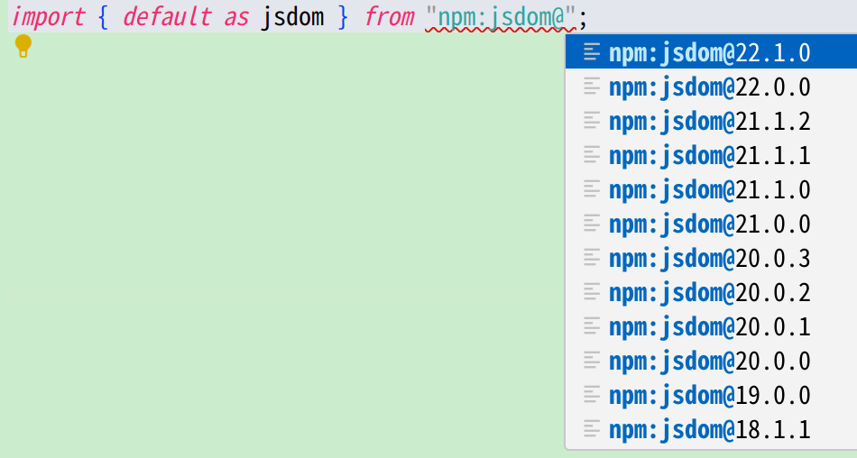

# Denoばた会議 Monthly 第23回

<!-- _class: lead -->

---

# [Deno v1.37](https://uki00a.github.io/deno-weekly/articles/deno/v1.37)

<!-- _class: lead -->

---

## `deno jupyter`

以下でDeno Kernelをインストールできます。

```shell
$ deno jupyter --unstable --install
```

以下は[jupyter_console](https://github.com/jupyter/jupyter_console)との連携例です。

```shell
$ jupyter console --kernel deno
```

---

## TAPレポーター (`deno test --reporter=tap`)

```shell
$ deno test --allow-read --reporter=tap | deno run --allow-read npm:tap-nyan@1.1.0 
 10  -_-_-_-_-__,------,
 0   -_-_-_-_-__|  /\_/\ 
 0   -_-_-_-_-_~|_( ^ .^) 
     -_-_-_-_-_ ""  "" 
  Pass!
```

---

## `deno lsp`で`npm:`の入力補完がサポート



---

## TypeScript v5.2

TypeScript限定ですが、`using`が利用できます。

```typescript
class Disposable {
  [Symbol.dispose]() {
    console.info("Disposable: disposed!");
  }
}

{
  using disposable = new Disposable();
}
// => Disposable: disposed!
```

---

## [Import Attributes](https://github.com/tc39/proposal-import-attributes)が実装

```javascript
import config from "./deno.json" with { type: "json" };

console.info(config);
```

前身である[Import Assertions](https://uki00a.github.io/deno-weekly/articles/2021/12/19)については、今後、サポートが廃止される予定のようです。

---

## ロックファイル v3

1. リダイレクト元とリダイレクト先のURLの組み合わせが管理されるように改善
1. (おそらく) 後述の`jsr:`URLの導入などに向けた対応と推測されます。

---

## 実験的なパッケージマネージャ (`jsr:`URL)

**⚠️注意: パッケージレジストリがまだ公開されていないため、この機能はまだ利用できない状態です。**

```javascript
import { foo } from "jsr:@foo/some_pkg@1/mod.ts";
```

---

# その他の話題

<!-- _class: lead -->

---

## [deno_std v1](https://github.com/denoland/deno_std/issues/3489)について

v1のリリースに向けて整理が行われているようです。

- `std/collections`と`std/crypto`に`unstable/`ディレクトリが導入 ([v0.202.0](https://uki00a.github.io/deno-weekly/articles/2023/09/24))
- `std/streams`: `Deno.Reader`/`Deno.Writer`ベースの機能が非推奨化 ([v0.202.0](https://uki00a.github.io/deno-weekly/articles/2023/09/24))
- `std/io`が非推奨化 ([v0.203.0](https://uki00a.github.io/deno-weekly/articles/2023/10/01))

など

---

## Deno Queuesのアナウンス

[Deno v1.34.3](https://uki00a.github.io/deno-weekly/articles/2023/06/18)でDeno KVに実装されたキューの機能が正式にアナウンスされました。

- [Announcing Deno Queues](https://deno.com/blog/queues)

---

## WebGPU APIの再導入について

[Deno v1.32](https://uki00a.github.io/deno-weekly/articles/deno/v1.32)で一時的に削除されていたWebGPU APIを再度導入するPRが作成されています。

> [bring back WebGPU #20812](https://github.com/denoland/deno/pull/20812)

まだマージはされていませんが、再びWebGPU APIが導入される可能性がありそうです。
